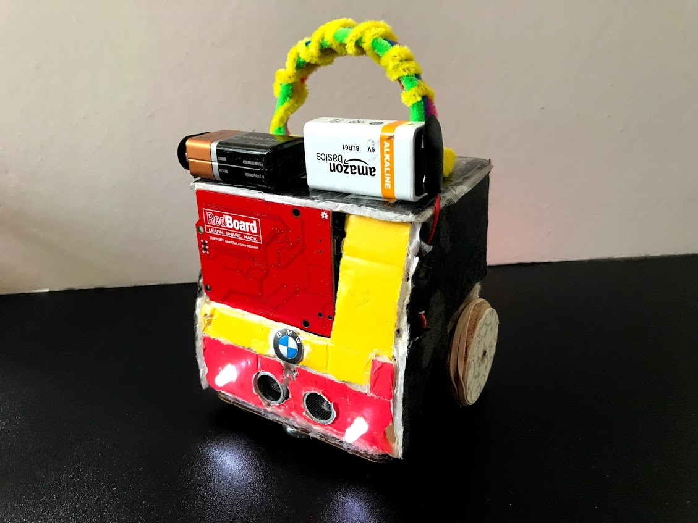

# Arduino-Bluetooth-Car

This project was created using Arduino. A Bluetooth module was implemented into the Arduino to create car controlled by an app on a tablet. The car uses two motors to make forward, left, right, and reverse directions. Creatively, the car uses LED's to allow pedestrians to determine the direction of the car's movement. This project also utilizes distance sensors to avoid objects in its path. Additionally, this project was coded in the Arduino language, C. The two batteries attached to the car's roof allows for more power to the motors. This BMW's design uses the traction of rubber bands to increase contact with the surface.

## Video Walkthrough 

Here's a walkthrough of implemented user stories:

GIF created with [LiceCap](http://www.cockos.com/licecap/).
